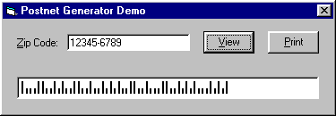



## PostNet Barcode Generator

### Description

BAS module that allows you to print

PostNet (aka 3 of 5) barcodes used

by the US Postal Service. Can output

to printer or screen (i.e. form,

picturebox, etc.) No DLL/OCX/TTF used.

All code.
 
### More Info
 

             |
---                |---
**Submitted On**   |2000-06-20 21:13:22
**By**             |[Tim Rude](https://github.com/Planet-Source-Code/PSCIndex/blob/master/ByAuthor/tim-rude.md)
**Level**          |Intermediate
**User Rating**    |4.7 (14 globes from 3 users)
**Compatibility**  |VB 5\.0, VB 6\.0
**Category**       |[Custom Controls/ Forms/  Menus](https://github.com/Planet-Source-Code/PSCIndex/blob/master/ByCategory/custom-controls-forms-menus__1-4.md)
**World**          |[Visual Basic](https://github.com/Planet-Source-Code/PSCIndex/blob/master/ByWorld/visual-basic.md)
**Archive File**   |[CODE\_UPLOAD69456202000\.zip](https://github.com/Planet-Source-Code/tim-rude-postnet-barcode-generator__1-9091/archive/master.zip)

